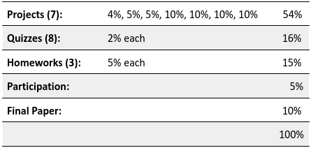
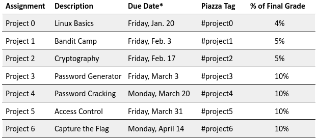
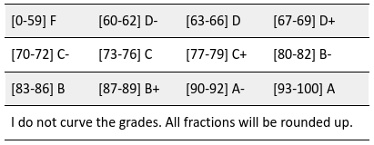



Course Syllabus
======

<strong>Course Description </strong>Major security breaches routinely make headline news and impact the lives of millions of people. Cybercrime is a multi-million dollar, mature business. Advanced, persistent threats posed by nation-state adversaries are beginning to impact critical infrastructure, and even democratic processes themselves. As technology becomes embedded in ever more facets of our lives, society, business, and government, the need for cybersecurity experts to protect our infrastructure grows. 

This course presents an overview of basic cybersecurity principles and concepts, including systems and communications security. The high-level goal is to introduce the breadth of topics in the cybersecurity space to students and begin training them to apply these ideas through an understanding of defensive mechanisms and attacker strategies.

The course will cover essential security properties like confidentiality and integrity, as well as desirable properties like least privilege and defense in depth. Concepts will be illustrated with practical tools, systems, and applications that exemplify them. Hands-on projects will introduce students to key security tools and libraries.

<strong>Course Objectives</strong>

<ul>
    <li aria-level="1">Provide a solid understanding of the core cybersecurity principles and concepts, including systems and communication security.</li>
</ul>
<ul>
    <li aria-level="1">Introduce the breadth of topics in the cybersecurity space.</li>
    <li aria-level="1">Provide hands-on experience in achieving essential security properties like confidentiality and integrity, as well as desirable properties like least privilege and defense in depth.</li>
</ul>

<strong>Attendance, Lecture Format, and In-class Prep </strong>While attendance is not mandatory, it is strongly encouraged to attend class. Quizzes and homework assignments will be based on the material learned in class, and with quizzes being more of the <strong><i>&lsquo;pop&rsquo;</i></strong> variety, one does not want to potentially lose out on points. It is also important to note, some of the homework and projects require classmate communication, so knowing other students can make some projects easier. Wellness days can be used whenever a student prefers.

This class will use a traditional, lecture-style format, punctuated with in-class examples. Slides are available in the course schedule below.

I recommend that students bring a laptop to class that has access to a local Unix/Linux-style command line. You can rely on SSH or <a href="http://www.putty.org/">PuTTY</a> to get a remote command line on the Khoury College machines, but you run the risk of Wifi connection issues leaving you unable to work. macOS users should be able to use the default Mac command line and <a href="https://brew.sh/">Homebrew</a>; Windows users can install Linux in a virtual machine, or, if you have a recent version of Windows 10, you can <a href="https://docs.microsoft.com/en-us/windows/wsl/install-win10">install the Windows Subsystem for Linux (WSL) and then download a copy of Ubuntu right from the Windows Store</a>.

<strong>Ethics </strong>In this class, you will learn about security techniques and tools that can potentially be used for offensive purposes; "hacking" in other words. <strong>It is imperative that students only use these tools and techniques on systems they own (your personal computers) or systems that are sanctioned by the instructor. NEVER perform attacks against public systems that you do not control.</strong> As we will discuss in class, it is ethically problematic to attack systems that you do not own and may violate the law.

<strong>Disclaimer </strong>This course is about the legal implications of certain behavior related to the use of information technologies and activities in cyberspace. Every effort will be made to provide accurate and complete information. <strong><i>Please note</i></strong><i>, however, that at no time during this course will legal advice be offered. Any student or attendee needing legal advice should seek the services of a lawyer authorized to practice in the appropriate jurisdiction</i>.

<strong>Course Material </strong>I do not require students to get textbooks. However, there is one that will be <strong>required</strong> reading during this course:

<ul>
    <li aria-level="1"><a href="https://www.amazon.com/Ghost-Wires-Adventures-Worlds-Wanted/dp/0316037729/">Ghost in the Wires: My Adventures as the World's Most Wanted Hacker</a> by Kevin Mitnick</li>
</ul>

<i>Recommended Reading (Not Required):</i>

<ul>
    <li aria-level="1"><a href="https://www.amazon.com/Countdown-Zero-Day-Stuxnet-Digital/dp/0770436196/">Countdown to Zero Day: Stuxnet and the Launch of the World's First Digital Weapon</a> by Kim Zetter</li>
    <li aria-level="1"><a href="https://www.amazon.com/Privacys-Blueprint-Battle-Control-Technologies/dp/0674976002/ref=sr_1_2?keywords=woodrow+hartzog&amp;qid=1672445847&amp;sprefix=woodrow+har%2Caps%2C319&amp;sr=8-2">Privacy&rsquo;s Blueprint: The Battle to Control the Design of New Technologies</a> by Woodrow Hartzog</li>
    <li aria-level="1"><a style="font-family: inherit; font-size: 1rem;" href="https://www.amazon.com/Fifth-Domain-Defending-Companies-Ourselves/dp/052556196X/ref=sr_1_fkmr0_1?crid=3RNAF685ALLWK&amp;keywords=rob+knake&amp;qid=1672445898&amp;sprefix=rob+knake%2Caps%2C134&amp;sr=8-1-fkmr0">The Fifth Domain: Defending Our Country, Our Companies, and Ourselves in the Age of Cyber Threats</a> by Richard A. Clarke and Robert K. Knake</li>
</ul>

<strong>Course Schedule </strong><strong><i>** Potentially Subject to Change Based On Exterior Factors **</i></strong>

<table style="border-collapse: collapse; border-color: #000000; border-style: solid; width: 47.0953%;" border="1">
    <tbody>
        <tr>
            <td style="width: 25.0143%;">
                
<strong>Week Number</strong>

            </td>
            <td style="width: 74.7696%;">
                
<strong>Topic</strong>

            </td>
        </tr>
        <tr>
            <td style="width: 25.0143%;">
                
Week 1

            </td>
            <td style="width: 74.7696%;">
                
Course Introduction, History of Cybersecurity

            </td>
        </tr>
        <tr>
            <td style="width: 25.0143%;">
                
Week 2

            </td>
            <td style="width: 74.7696%;">
                
Threat Modeling

            </td>
        </tr>
        <tr>
            <td style="width: 25.0143%;">
                
Week 3

            </td>
            <td style="width: 74.7696%;">
                
Cryptography

            </td>
        </tr>
        <tr>
            <td style="width: 25.0143%;">
                
Week 4

            </td>
            <td style="width: 74.7696%;">
                
Cryptography, Authentication &amp; Passwords

            </td>
        </tr>
        <tr>
            <td style="width: 25.0143%;">
                
Week 5

            </td>
            <td style="width: 74.7696%;">
                
Access Control

            </td>
        </tr>
        <tr>
            <td style="width: 25.0143%;">
                
Week 6

            </td>
            <td style="width: 74.7696%;">
                
Social Engineering, Cyberlaw, and Ethics

            </td>
        </tr>
        <tr>
            <td style="width: 25.0143%;">
                
Week 7

            </td>
            <td style="width: 74.7696%;">
                
Cyberlaw and Ethics, Systems Security

            </td>
        </tr>
        <tr>
            <td style="width: 25.0143%;">
                
Week 8

            </td>
            <td style="width: 74.7696%;">
                
Systems Security, Exploits

            </td>
        </tr>
        <tr>
            <td style="width: 25.0143%;">
                
Week 9

            </td>
            <td style="width: 74.7696%;">
                
<strong>Spring Break</strong>

            </td>
        </tr>
        <tr>
            <td style="width: 25.0143%;">
                
Week 10

            </td>
            <td style="width: 74.7696%;">
                
Exploits

            </td>
        </tr>
        <tr>
            <td style="width: 25.0143%;">
                
Week 11

            </td>
            <td style="width: 74.7696%;">
                
Cybercrime Underground and Botnets

            </td>
        </tr>
        <tr>
            <td style="width: 25.0143%;">
                
Week 12

            </td>
            <td style="width: 74.7696%;">
                
DDoS, APT

            </td>
        </tr>
        <tr>
            <td style="width: 25.0143%;">
                
Week 13

            </td>
            <td style="width: 74.7696%;">
                
Web Privacy

            </td>
        </tr>
        <tr>
            <td style="width: 25.0143%;">
                
Week 14

            </td>
            <td style="width: 74.7696%;">
                
Moving Forward in Cybersecurity

            </td>
        </tr>
        <tr>
            <td style="width: 25.0143%;">
                
Week 15

            </td>
            <td style="width: 74.7696%;">
                
No Lecture, Final Class

            </td>
        </tr>
        <tr>
            <td style="width: 25.0143%;">
                
Week 16

            </td>
            <td style="width: 74.7696%;">
                
<strong>FINAL EXAM WEEK</strong>

            </td>
        </tr>
    </tbody>
</table>

<strong>Grading </strong><strong><i>The overall course grade will be established as follows*: </i></strong><i> </i><i>* The professor holds the right to adjust/alter the grading if necessary.</i>

<strong>Projects <em>(54% of Total Grade)</em> </strong>There will be <strong>seven (7)</strong> projects throughout the semester. <strong>Projects are due at 11:59:59pm on the specified date.</strong> You will use a turn-in script to create a compressed archive of the necessary files for the assignments, timestamp them, and submit them for grading. I highly recommend that students start assignments early!  <i>* Dates, while mostly set in stone, have the potential to be extended under certain circumstances.</i> 

<strong>Quizzes <em>(2% each, 16% of Total Grade) </em></strong>Throughout the semester, there will be <strong>eight (8)</strong> quizzes. These quizzes will be brief; they are designed to be completed in 30 minutes or (<i>probably</i>) less. They are not meant to cause students grief. The goals of the quizzes are to incentivize attendance and encourage the careful study of the lecture material. If a student misses a class due to a Wellness Day, that quiz can be made up during an office hour or through communication with the professor.

<strong>Homework Assignments <em>(5% each, 15% of Total Grade) </em></strong>There will be three (3) homework assignments during the semester. These assignments will have a range of questions that are meant to challenge the students from what they learn in class. They will also think beyond the material to provide their own opinions while answering questions in the homework. Homework assignments will be a variety of short answer and open-response questions. <strong>Unless specified, homework assignments are to be done alone</strong>.  

<strong>Participation <em>(5% of Total Grade) </em></strong>I do not require students to attend class, and we won&rsquo;t be taking attendance. If you need to miss class for any reason, you don&rsquo;t need to tell us beforehand. That said, we like teaching and interacting with students, so please attend class and speak up. We welcome questions and discussion! Note that your participation grade will be based not only on your participation in class but also on the Piazza forum; please feel free to engage with other students there (but do not simply give out answers to the questions, of course).

<strong>Final Paper <em>(10% of Total Grade) </em></strong>The final paper is designed for students to apply what they learn in the class to a real-world example. As this paper substitutes the final exam, it is expected that students will pull the knowledge they have accumulated from the lectures, homework, and projects to look at a real cybersecurity event. It also serves as an opportunity to conduct individual research as well as explore some of the more interesting cybersecurity issues with greater depth than is offered in the class. This assignment will be completed as an individual and will be due on <strong>Friday, April 21st at 9:00 PM EST.</strong> There will be plenty of time to complete this assignment so slip days will not apply, only extreme circumstances will allow for an extension on a case-by-case basis. 

<strong>Extra Credit<em> </em></strong>There is no guaranteed extra credit in this course. The best way to get a good grade in this course is to understand the material and dedicate sufficient time to the projects and homework. By week 10, there may be an option to pick up extra points. If there is an added extra credit option it will strictly be individual work, no teams. 

<strong>Lack of Exams<em> </em></strong>Why no exams? My personal approach to education is that many exams don&rsquo;t test for knowledge, they test for memorization. I would rather assign homework and projects that are more thought-provoking and allow students to answer questions that may be more than cut-and-dry answers. The benefits of test-taking will be on a smaller scale with quizzes. 

<strong>Classroom Environment<em> </em></strong>To create and preserve a classroom atmosphere that optimizes teaching and learning, all participants share responsibility for creating a civil and non-disruptive forum for the discussion of ideas. Students are expected to conduct themselves at all times in a manner that does not disrupt teaching or learning. Your comments to others should be constructive and free from harassing statements. You are encouraged to disagree with other students and the instructor, but such disagreements need to be respectful and be based on facts and documentation (rather than prejudices and personalities). The instructor reserves the right to interrupt conversations that deviate from these expectations. <strong><i>Repeated unprofessional or disrespectful conduct may result in a lower grade or more severe consequences.</i></strong> Part of the learning process in this course is a respectful engagement of ideas with others. 

<strong>Letter Grades<em> </em></strong> <em><strong>I do not curve the grades. All fractions will be rounded up.</strong></em> 

<strong>Request for Regrading<em> </em></strong>In this class, we will use the <a href="http://entertainment.howstuffworks.com/nfl-review-rules2.htm">Coaches Challenge</a> to handle requests for regrading. Each student is allotted two (2) <i>challenges</i> each semester. If you want a project, quiz, or homework to be regraded, you must come to the professors' office hours and make a formal <i>challenge</i> specifying <strong>(a)</strong> the problem or problems you want to be regraded, and <strong>(b)</strong> for each of these problems, why you think the problem was misgraded. If it turns out that there has been an error in grading, the grade will be corrected, and you get to keep your <i>challenge</i>. However, if the original grade was correct, then you permanently lose your <i>challenge</i>. Once your two <i>challenges</i> are exhausted, you will not be able to request regrades. You may not <i>challenge</i> the use of slip days or any points lost due to lateness. Note that, in the case of projects, all group members must have an available <i>challenge</i> in order to contest a grade. If the <i>challenge</i> is successful, then all group members get to keep their <i>challenge</i>. However, if the <i>challenge</i> is unsuccessful, then all group members permanently lose one <i>challenge</i>. 

<strong>Late Policy <em></em></strong>For programming projects and homework, we will use flexible slip days. Each student is given ten (10) slip days for the semester. You may use the slip days on any project or homework during the semester in increments of one day. For example, you can hand in one project ten days late, or one project two days late, and two projects four days late. You do not need to ask permission before using slip days; simply turn in your assignment late and the grading scripts will automatically tabulate any slip days you have used.

Slip days will be deducted from each group member's remaining slip days. Keep this stipulation in mind: if one member of a group has zero slip days remaining, then that means the whole group has zero slip days remaining.

After you have used up your slip days, any project handed in late will be marked off using the following formula:

<pre>Original_Grade * (1 - ceiling(Seconds_Late / 86400) * 0.2) = Late_Grade</pre>

In other words, every day late is 20% off your grade. Being 1 second late is exactly equivalent to being 23 hours and 59 minutes late. Since you will be turning in your assignments on Gradescope, their clocks are the benchmark time (so beware clock skew between your desktop and Khoury College if you're thinking about turning in work seconds before the deadline). <strong><i>My late policy is extremely generous, and therefore we will not be sympathetic to excuses for lateness.</i></strong> 

<strong>Cheating Policy </strong>It's ok to ask your peers about the concepts, algorithms, or approaches needed to do the assignments. We encourage you to do so; both giving and taking advice will help you to learn. However, what you turn in must be your own, or for projects, your group's own work. Looking at or copying code or homework solutions from other people or the Web is strictly prohibited. In particular, looking at other solutions (e.g., from other groups or students who previously took the course) is a direct violation. Projects must be entirely the work of the students turning them in, i.e. you and your group members. If you have any questions about using a particular resource, ask the course staff or post a question to the class forum.

All students are subject to Northeastern University's <a href="http://www.northeastern.edu/osccr/academichonesty.html">Academic Integrity Policy</a>. Per Khoury College policy, all cases of suspected plagiarism or other academic dishonesty must be referred to the Office of Student Conduct and Conflict Resolution (OSCCR). This may result in deferred suspension, suspension, or expulsion from the university.

<strong>Student Accommodations </strong>Northeastern University and the Disability Resource Center (DRC) are committed to providing disability services that enable students who qualify under Section 504 of the Rehabilitation Act and the Americans with Disabilities Act Amendments Act (ADAAA) to participate fully in the activities of the university. To receive accommodations through the DRC, students must provide appropriate documentation that demonstrates a current substantially limiting disability.&nbsp;

For more information, visit <a href="http://www.northeastern.edu/drc/getting-started-with-the-drc/">http://www.northeastern.edu/drc/getting-started-with-the-drc/</a>. 

<strong>Diversity and Inclusion </strong>Northeastern University is committed to equal opportunity, affirmative action, diversity, and social justice while building a climate of inclusion on and beyond campus. In the classroom, members of the University community work to cultivate an inclusive environment that denounces discrimination through innovation, collaboration, and an awareness of global perspectives on social justice.

Please visit <a href="http://www.northeastern.edu/oidi/">http://www.northeastern.edu/oidi/</a> for complete information on Diversity and Inclusion. 

<strong>Title IX </strong>Title IX makes it clear that violence and harassment based on sex and gender are Civil Rights offenses subject to the same kinds of accountability and the same kinds of support applied to offenses against other protected categories such as race, national origin, etc. If you or someone you know has been harassed or assaulted, you can find the appropriate resources <a href="http://www.northeastern.edu/oidi/titleix/">here</a>. 

<i></i>

