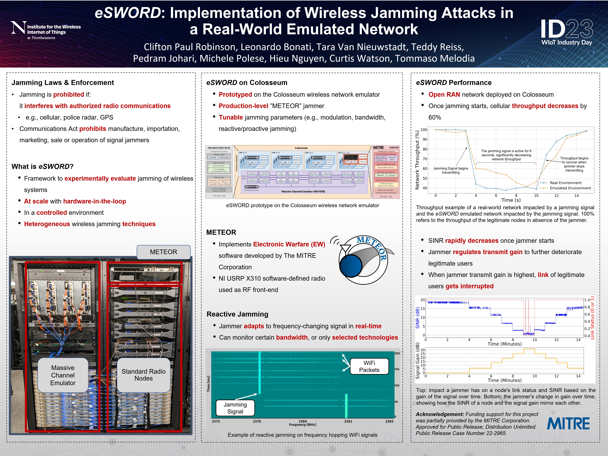
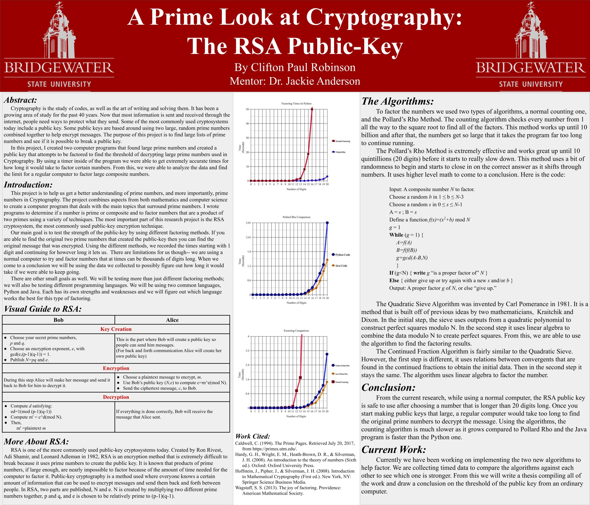

<table cellpadding="0" cellspacing="0" border="0" style="background-color: white; border-collapse: collapse;">
  <tr>
    <td style="text-align: left; padding: 0; border: 0.1px solid white; vertical-align: top;">
      <h1 style="margin: 0;">2024</h1>
      <h2 style="margin-top: 0;"><strong><em>DeepSweep:</em> Parallel and Scalable Spectrum Sensing via Convolutional Neural Networks</strong></h2>
      <ul style="margin-top: 0;">
        <li>IEEE International Conference on Machine Learning for Communication and Networking (IEEE ICMLCN 2024), Stockholm, Sweden</li>
        <li>May 2024</li>
        <li><strong><em>Abstract:</em></strong> Spectrum sensing is an essential component of modern wireless networks as it offers a tool to characterize spectrum usage and better utilize it. Deep Learning (DL) has become one of the most used techniques to perform spectrum sensing as they are capable of delivering high accuracy and reliability. However, current techniques suffer from ad-hoc implementations and high complexity, which makes them unsuited for practical deployment on wireless systems where flexibility and fast inference time are necessary to support real-time spectrum sensing. In this paper, we introduce DeepSweep, a novel DL-based transceiver design that allows scalable, accurate, and fast spectrum sensing while maintaining a high level of customizability to adapt its design to a broad range of application scenarios and use cases. DeepSweep is designed to be seamlessly integrated with well-established transceiver designs and leverages shallow convolutional neural network (CNN) to "sweep" the spectrum and process captured IQ samples fast and reliably without interrupting ongoing demodulation and decoding operations. DeepSweep reduces training and inference times by more than 2 times and 10 times respectively, achieves up to 98 percent accuracy in locating spectrum activity, and produces outputs in less than 1 ms, thus showing that DeepSweep can be used for a broad range of spectrum sensing applications and scenarios.</li>
      </ul>
    </td>
  </tr>
</table>

<table cellpadding="0" cellspacing="0" border="0" style="background-color: white; border-collapse: collapse;">
  <tr>
    <td style="text-align: left; padding: 0; border: 0.1px solid white; vertical-align: top;">
      <h1 style="margin: 0;">2023</h1>
      <h2 style="margin-top: 0;"><strong><em>eSWORD:</em> Implementation of Wireless Jamming Attacks in a Real-World Emulated Network</strong></h2>
      <ul style="margin-top: 0;">
        <li>WIoT Industry Day 2023, Boston, MA</li>
        <li>May 2023</li>
      </ul>
      
      <h2 style="margin-top: 0;"><strong><em>eSWORD:</em> Implementation of Wireless Jamming Attacks in a Real-World Emulated Network</strong></h2>
      <ul style="margin-top: 0;">
        <li>IEEE Wireless Communications and Networking Conference (IEEE WCNC 2023), Glasgow, Scotland</li>
        <li>March 2023</li>
        <li><strong><em>Abstract:</em></strong> Jamming attacks have plagued wireless communication systems and will continue to do so going forward with technological advances. These attacks fall under the category of Electronic Warfare (EW), a continuously growing area in both attack and defense of the electromagnetic spectrum, with one subcategory being electronic attacks (EA). Jamming attacks fall under this specific subcategory of EW as they comprise adversarial signals that attempt to disrupt, deny, degrade, destroy, or deceive legitimate signals in the electromagnetic spectrum. While jamming is not going away, recent research advances have started to get the upper hand against these attacks by leveraging new methods and techniques, such as machine learning. However, testing such jamming solutions on a wide and realistic scale is a daunting task due to strict regulations on spectrum emissions. In this paper, we introduce eSWORD (emulation (of) Signal Warfare On Radio-frequency Devices), the first large-scale framework that allows users to safely conduct real-time and controlled jamming experiments with hardware-in-the-loop. This is done by integrating METEOR, an electronic warfare (EW) threat-emulating software developed by the MITRE Corporation, into the Colosseum wireless network emulator that enables large-scale experiments with up to 49 software-defined radio nodes. We compare the performance of eSWORD with that of real-world jamming systems by using an over-the-air wireless testbed (considering safe measures when conducting experiments). Our experimental results demonstrate that eSWORD achieves up to 98% accuracy in following throughput, signal-to-interference-plus-noise ratio, and link status patterns when compared to real-world jamming experiments, testifying to the high accuracy of the emulated eSWORD setup.</li>
      </ul>
    </td>
  </tr>
</table>

<table cellpadding="0" cellspacing="0" border="0" style="background-color: white; border-collapse: collapse;">
  <tr>
    <td style="text-align: left; padding: 0; border: 0.1px solid white; vertical-align: top;">
      <h1 style="margin: 0;">2018</h1>
      <h2 style="margin-top: 0;"><strong>The Key to Cryptography: The RSA Algorithm</strong></h2>
      <ul style="margin-top: 0;">
        <li>National Conference on Undergraduate Research 2018 (NCUR), Edmond, OK</li>
        <li>April 2018</li>
      </ul>
      
      <h2 style="margin-top: 0;"><strong>Cyber Law: Past, Present, and Future</strong></h2>
      <ul style="margin-top: 0;">
        <li>Massachusetts Statewide Undergraduate Research Conference, University of Massachusetts Amherst</li>
        <li>April 2018</li>
        <li><strong><em>Abstract:</em></strong> Laws based on cyber crimes are a new trend in government. What should be regulated online? Should people be held responsible for what they do or post? Can your First Amendment rights be taken away online? How are you affected by laws today? These are questions that are brought up and debated when discussing cyber laws and policies. Starting with a historical view, we look back at why these policies needed to be put into place and how it plays a part in society. We also look at the history of hacking and how it plays a part in today. As we take a step towards the future, we consider new laws that could be put in place and the freedoms everyone should have.    We live in the age where these laws and policies are being defined. In 2017 alone we dealt with two major political problems, Net Neutrality and the Russian Hacking Scandal, that were in the spotlight and will shape the landscape of politics that surround issues on the internet. There are already laws in place that protect people's rights on the internet, such as your credit card information, but there are only a certain few. Moving forward, we will use current issues that we face today to create possible laws for moving forward in the future. Within the next few years, cyber laws and policies will become a larger issue. Being prepared on this issue will be important when attempting to tackle laws surrounding the internet.</li>
      </ul>
    </td>
  </tr>
</table>
